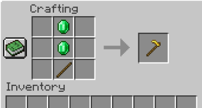

# Item Serializer

```yaml
Item:
  Type: <Material>
  Name: <name>
  Lore:
  - <Lore line>
  - <etc.>
  Unbreakable: <true/false>
  Custom_Model_Data: <custom model data number>
  Hide_Flags: <true/false>
  Max_Stack_Size: <amount>
  Enchantment_Glint_Override: <true/false>
  Damage_Resistant: <DamageType>
  Enchantments:
  - <Enchantment> <Level>
  Durability:
    Damage: <integer>
    Max_Damage: <integer>
  Tool:
    Default_Mining_Speed: <amount>
    Damage_Per_Block: <integer>
    Rules:
    - <block> <amount>
    - <block> <amount> <drop item true/false>
    - <etc.>
  Food:
    Nutrition: <food bars>
    Saturation: <integer>
    Can_Always_Eat: <true/false>
  Equippable:
    Slot: <FEET/LEGS/CHEST/HEAD/BODY>
    Equip_Sound: <Sound>
    Model: "minecraft:model_location"
    Camera_Overlay: "minecraft:overlay_location"
    Dispensable: <true/false>
    Swappable: <true/false>
    Damage_On_Hurt: <true/false>
    Entities:
    - <EntityType>
  Attributes:
  - <Attribute> <Amount>
  - <Attribute> <Amount> <Slot>
  - <Attribute> <Amount> <Slot> <Operation>
  - <etc.>
  Skull_Owning_Player: <UUID> <URL>
  Potion_Color: <Color>
  Leather_Color: <Color>
  Trim_Pattern: <Pattern>
  Trim_Material: <Material>
  Firework:
    Power: <firework power>
    Effects:
      - <Firework.Type> <ColorSerializer>
      - <Firework.Type> <ColorSerializer> <Trail> <Flicker>
      - <Firework.Type> <ColorSerializer> <Trail> <Flicker> <fade ColorSerializer>
      - <etc.>
  Light_Level: <1-16>
  Deny_Use_In_Crafting: <true/false>
  Recipe:
    Shape:
      - "012"
      - "345"
      - "678"
    Ingredients:
      '0': <ItemSerializer>
      '1': <ItemSerializer>
      <etc.>
    Output_Amount: <Integer>
  Tags:
    - <String> <Integer>
```


## Shorthand

Just looking for a simple vanilla item (no lore, no display, etc.)? Then, use a shorthand by specifying the [#material](references.md#material "mention") without any other config options.&#x20;

```yaml
Item: DIRT # Shorthand for dirt
```


#### Type

The [#material](references.md#material "mention") used for the item. For example, `feather`.

#### Name

The display name of the item.

<details>

<summary>Color Codes</summary>

We use[ MiniMessage](https://docs.advntr.dev/minimessage/format.html) to parse messages, a text format that allows colors, links, hoverables, and many other features. MiniMessage also provides an [editor](https://webui.advntr.dev/) for you to build your messages! Check out the default colors below:


</details>

#### Lore

A list of strings to use as the lore of the item.&#x20;

<details>

<summary>Color Codes</summary>

We use[ MiniMessage](https://docs.advntr.dev/minimessage/format.html) to parse messages, a text format that allows colors, links, hoverables, and many other features. MiniMessage also provides an [editor](https://webui.advntr.dev/) for you to build your messages! Check out the default colors below:


</details>

#### Unbreakable

Use `true` for the item to be unbreakable. Unbreakable items do not show their durability bar, and can never be broken by durability.&#x20;

#### Custom\_Model\_Data

The [custom model data](https://www.planetminecraft.com/forums/communities/texturing/new-1-14-custom-item-models-tuto-578834/) of the item. Your server must be in MC 1.14.4 or higher.&#x20;

#### Hide\_Flags

Hides all item flags (Enchantments, Attributes, Unbreakable, Destroys, Placed on, Potion effects, Dye color).

#### Max\_Stack\_Size

Overrides the stack size for this item. Typically either `1`, `16`, or `64`. This can be used to make your items unstackable.

#### Enchantment\_Glint\_Override

If true, your item will have the enchantment shine. If false, your item will not have the enchantment shine, regardless of enchantments.

#### Is\_Fire\_Resistant

If true, your item will be immune to fire/lava, just like netherite armor is immune to fire/lava.

#### Damage\_Resistant

Let's your item be immune to 1 type of damage. Try:

* `is_explosion` :  Prevent explosions from damaging items
* `is_fire`: Prevent fire from damaging items

#### Enchantments

Adds a list of enchantments with specified levels. Use the [#enchantment](references.md#enchantment "mention") list.&#x20;

The following example gives sharpness 5 and smite 5:

```yaml
  Item:
    # Other args...
    Enchantments:
      - sharpness 5
      - smite 5
```

#### Durability

Used to let your items have a durability bar.&#x20;

* `Damage`: How much damage is already applied to the item, by default
* `Max_Damage` : The total amount of damage the item can take before breaking


The Durability feature cannot be used with the Unbreaking or Max\_Stack\_Size features due to Minecraft limitations.


#### Tool

Turns your item into a "tool" which can be used to customize the mining speed on certain blocks.

* `Default_Mining_Speed`: The "base rate" of your tool
  * Typically you use `1.0` here
* `Damage_Per_Block`: How much damage your tool takes, if `Durability` is also used.
* `Rules`
  * Follows the format: `<block> <mining speed> <drops item true/false>`
  * For example, `#wool 2.0 true` lets the tool mine all wools at 2x speed

#### Food

Turns your item into food, which can be eaten by the player for saturation.

* `Nutrition`: The amount of food bars to restore
* `Saturation`: The amount of healing to do
* `Can_Always_Eat`: true if the food can always be eaten, like a golden apple

#### Equippable

Turns your item into an equippable item, like armor. Equippable armor can be worn by entities.

* `Slot`: The slot to equip to, either `FEET/LEGS/CHEST/HEAD`
  * You can also use `BODY` for horses/wolves
* `Equip_Sound`: The minecraft sound to play when the item is equipped
* `Model`: The resource location of the model of the armor
* `Camera_Overlay`: The resource location of the overlay, like the pumpkin overlay when worn on the head.
* `Dispensable`: `true` if the item can be equipped by a dispenser
* `Swappable`: `true` if the item can be swapped using "right click"
* `Damage_On_Hurt`: `true` if the item should be damaged when the user takes damage.
* `Entities`: The entities that can equip the armor

#### Skull\_Owning\_Player

The name of the player to use if `Type: PLAYER_HEAD`. Want to use custom player heads? Use the format `"UUID URL"`.&#x20;


Custom player head tutorial


#### Potion\_Color

The color of the potion bottle if `Type: POTION`. Uses [.](./ "mention").&#x20;

For example, `Potion_Color: "255-0-0"` is red.&#x20;

#### Attributes

List of attributes to apply to the item. Follows the format `attribute value slot operation`. The "slot" argument is optional; leaving it blank will let all slots work for the attribute. The "operation" argument is optional; leaving it blank defaults to `ADD_VALUE`.

See a list of all attributes [here](https://hub.spigotmc.org/javadocs/spigot/org/bukkit/attribute/Attribute.html). See a list of all slots [here](https://hub.spigotmc.org/javadocs/bukkit/org/bukkit/inventory/EquipmentSlotGroup.html). See a list of all operations [here](https://hub.spigotmc.org/javadocs/spigot/org/bukkit/attribute/AttributeModifier.Operation.html).

Example:

```yaml
  Attributes:
  - MAX_HEALTH 5 feet               # gain 2.5 hearts
  - KNOCKBACK_RESISTANCE 0.25 feet  # take 25% less knockback
  - MOVEMENT_SPEED -0.07 feet       # go very slow
```

#### Leather\_Color

The color of your leather armor (Make sure your `Type` is a leather armor). Uses [.](./ "mention").

#### Light\_Level

The light level used if you are using `LIGHT` as your material. This is usually used in [Particle](https://app.gitbook.com/s/hz7yMxlL81NxAT44nraH/mechanics/particle "mention") to spawn custom `BLOCK_MARKER` particles. This can be used for smoke grenades. Notice how in the example below for the [Particle](https://app.gitbook.com/s/hz7yMxlL81NxAT44nraH/mechanics/particle "mention") mechanic, instead of just using `materialData=LIGHT`, we used `materialData={type=LIGHT, lightLevel=0}`.&#x20;

```yaml
      - "Particle{particle=block_marker, materialData={type=LIGHT, lightLevel=0}, count=20, noise=3 2 3, repeatInterval=1, repeatAmount=580}"
```

#### Firework

Sets the firework data of the firework. Make sure to use `Type: firework_rocket` or `Type: firework` with this depending on your server version.

* `Power`: \<Integer>
  * Defines the power of firework
* `Effects`: \<String List>
  * Format: `<shape> <color> <trail> <flicker> <fadeColor>`
  * `shape`:
    * Required value which defines firework type
    * Available values: `BALL`, `BALL_LARGE`, `STAR`, `BURST`, `CREEPER`
  * `color`:
    * Required value which defines firework color
    * For example, `#ff0000` is red.
    * Uses [.](./ "mention")
  * `trail`:
    * true or false
    * Optional value which defines whether firework has [trail](https://minecraft.fandom.com/wiki/Firework_Star#Additional_effects)
  * `flicker`:
    * true or false
    * Optional value which defines whether firework has [flicker](https://minecraft.fandom.com/wiki/Firework_Star#Additional_effects) (twinkle).
  * `fadeColor`:
    * Optional value which defines firework fade color
    * For example, `#ffff00` is yellow.
    * Uses [.](./ "mention")

#### Deny\_Use\_In\_Crafting

Use `true` to prevent this item from being used in crafting.


This option also disables shift-clicking items. To let players shift-click items, use `Deny_Use_In_Crafting: false` or delete the option from your config (Defaults to false).&#x20;


#### Recipe


When modifying your recipe config, you **must restart your server.** Recipes are only refreshed on restarts.


* `Shape` -> The shape of the crafting recipe. Use single letters.
* `Ingredients` -> The items required to craft.
* `Output_Amount` -> How many items to output (Like 4 arrows). Defaults to 1.&#x20;


Item crafting recipe tutorial


For example, the following recipe creates a recipe like an emerald sword:



```yaml
  Recipe:
    Shape:
      - "e"
      - "e"
      - "s"
    Ingredients:
      'e': EMERALD
      's': STICK
```

#### Tags

These are custom NBT tags given to your item that have **NO EFFECT** on the behavior of the item. This is useful for commands, like: `/minecraft:clear @p feather{"PublicBukkitValues":{"custom:<your_tag_here>":<your number here>}}`.
